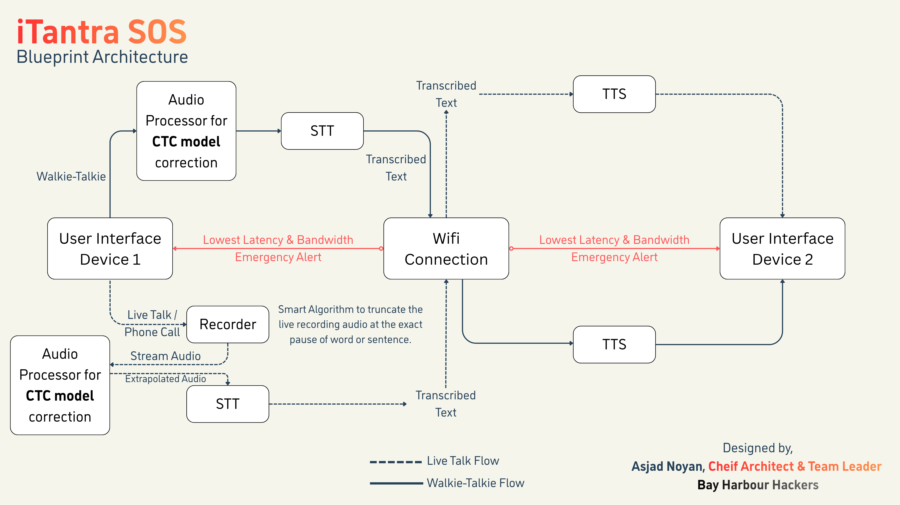

# iTantra SOS
Offline Android app for disaster/distress communication with on-device Hindi STT ↔ TTS over WiFi Direct, walkie-talkie style.

> By Team ***"Bay Harbour Hackers"***

## Blueprint Architecture of iTantra SOS


```structure
GitHub Repository Important files
iTantra/
├── Blueprint/
│   └── blueprint.png
├── android/
│   ├── app/
│   │   └── src/
│   │       └── main/
│   │           └── kotlin/
│   │               └── com.noyan.i_tantra
│   │                   └── MainActivity.kt   -------> Android Native controls for Alarm, Wifi-direct.
├── assets/      
│   ├── stt/   ----> Contains the STT Model (Sherpa-ONNX)
│   └── tts/   ----> Contains TTS Models
├── lib/
│   ├── main.dart  ----> Entry point of the application & User Interface
│   └── services/
│       ├── asset_copy.dart  ----> Copies the assets to app storage
│       ├── metrics.dart  ----> Performance metrics Evaluation
│       ├── protocol.dart  ----> Defines the message format
│       ├── recorder.dart  ----> Audio recording for walkie-talkie and Live mode
│       ├── transport.dart  ----> WiFi Direct (WifiP2pManager) + TCP line transport
│       ├── stt_service.dart  ----> STT Service for speech to text along with CTC model issue fix
│       └── tts_service.dart  ----> TTS Service for text to speech
├── pubspec.yaml  ----> Contains the dependencies of this project
└── README.md
```

## Team Members
1. Asjad Noyan Syed (*Team Leader*)
2. Aradhya Kalode
3. Daksh Agarwal
4. Jairaj Shinde
5. Shagun Mishra
6. Mujtaba Khan

## Open-source Models Used
1. AI4Bharat Models